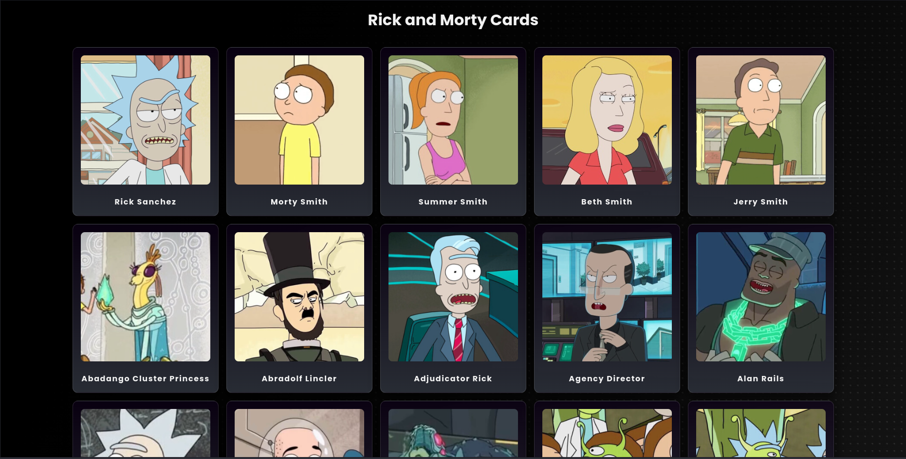
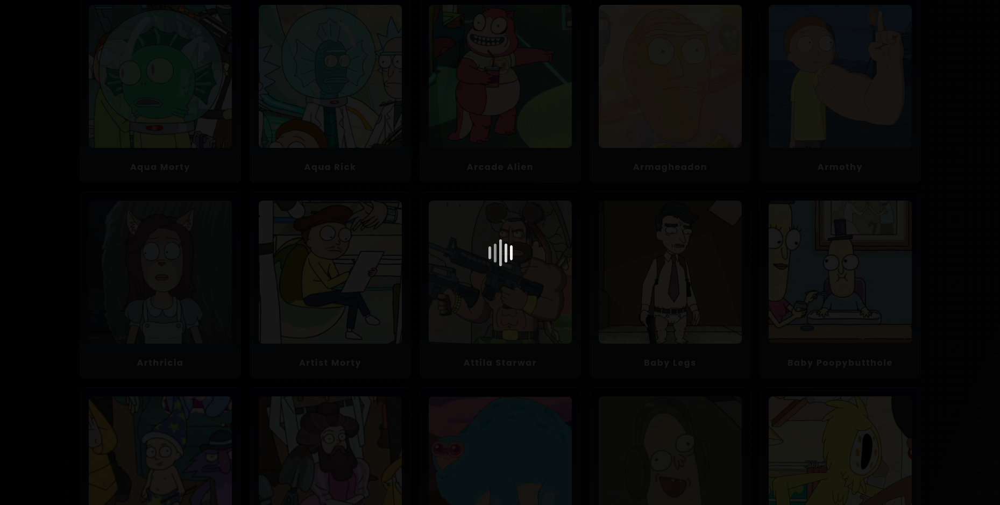

# Create animated cards with vanilla javascript

Infinite scroll using Intersection Observer API and Vanilla JavaScript.

<!-- TABLE OF CONTENTS -->
<details>
  <summary><strong>TABLE OF CONTENTS</strong></summary>
  <ul>
    <li><a href="#screenshot">Screenshots</a></li>
    <li>
      <a href="#getting-started">Getting Started</a>
      <ul>
        <li><a href="#setup">Setup</a></li>
      </ul>
    </li>
    <li><a href="#technologies">Technologies</a></li>
  </ul>
</details>

## Screenshots

| Cards                      |
| -------------------------- |
|  |

| Loading                        |
| ------------------------------ |
|  |

## Getting Started

### Setup

- Clone this repository

  ```sh

    git clone git@github.com:foschieraanderson/rick-and-morty-cards.git

    cd rick-and-morty-cards

  ```

- Run the **index.html** file or use python's http module for this

  ```sh

   python -m http.server 8000
   # Open http://localhost:8000 in your browser

  ```

## Technologies

- [JavaScript](https://developer.mozilla.org/en-US/docs/Web/javascript)
- [CSS](https://developer.mozilla.org/en-US/docs/Web/CSS)
- [HTML5](https://developer.mozilla.org/en-US/docs/Glossary/HTML5)
- [Intersection Observer API](https://developer.mozilla.org/en-US/docs/Web/API/Intersection_Observer_API)
- [Fetch API](https://developer.mozilla.org/en-US/docs/Web/API/Fetch_API)

---

<h4 align="center"> <em>&lt;/&gt;</em> <a href="https://github.com/foschieraanderson" target="_blank">foschieraanderson</a> </h4>
